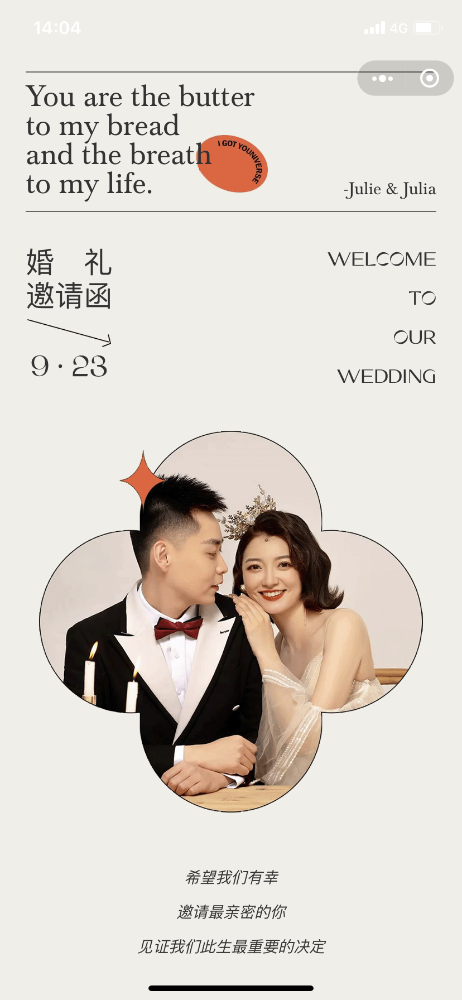

## 婚礼请柬-微信小程序

_超好看的微信小程序婚礼请柬_

_设计来源：[未](http://xhslink.com/sUyahu)_

#### 功能

- 好看
- 转发给朋友
- 分享到朋友圈
- 酒店位置展示
- 背景音乐
- 屏幕自适应

#### 预览

<figure class="half">
  
  
  
  
</figure>

#### 开发

- 最低基础库版本
  > - `2.25.4`
- 修改APPID
  > - `project.config.json -> appid`
- 修改背景音乐
  > - `app.js -> innerAudioContext.src`
- 转发给朋友内容
  > - `pages/index/index.js -> onShareAppMessage`
  > - `images/share-message.png`
- 分享到朋友圈内容
  > - `pages/index/index.js -> onShareTimeline`
  > - `images/share-timeline.png`
